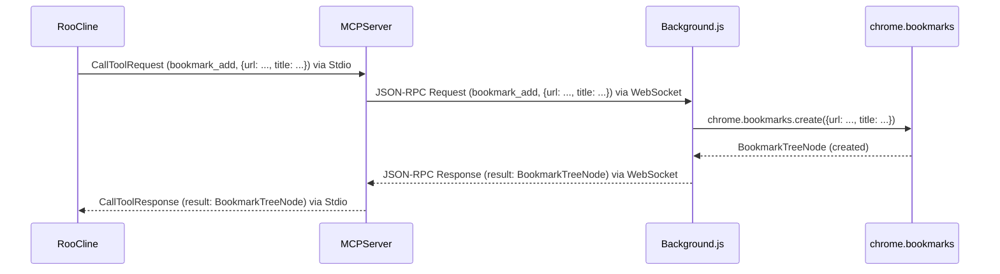
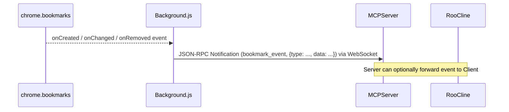

# Bookmark MCP 拡張機能・サーバー 設計ドキュメント

## 1. 概要

本ドキュメントは、ブックマーク操作に特化したMCP (Model Context Protocol) サーバーおよび連携するChrome拡張機能の設計について記述する。アーキテクチャは `tesla0225/chromeextension` を参考にし、WebSocketによる拡張機能との通信を主軸とする。

## 2. アーキテクチャ概要

```mermaid
graph TD
    subgraph User Machine
        RooCline[Roo Cline (MCP Client)] -- Stdio --> MCPServer(Bookmark MCP Server)
        MCPServer -- WebSocket (localhost:8765) --> ChromeExt(Chrome Extension)
        ChromeExt -- chrome.bookmarks API --> ChromeAPI(Chrome Bookmarks API)
        ChromeExt -- chrome.runtime --> PopupUI(Popup UI)
    end
```

*   **MCPサーバー:** Node.js (TypeScript) で実装。MCPクライアントとは標準入出力 (Stdio) で、Chrome拡張機能とはWebSocket (ポート8765) で通信する。
*   **Chrome拡張機能:** Manifest V3準拠。バックグラウンドスクリプトがWebSocket通信とブックマークAPI操作を担当。ポップアップUIは接続状態などを表示する。

## 3. コンポーネント詳細

### 3.1. MCPサーバー (`server/`)

*   **役割:**
    *   MCPクライアントからのリクエスト受付 (Stdio)。
    *   Chrome拡張機能とのWebSocket接続管理。
    *   リクエストをWebSocket経由で拡張機能に転送。
    *   拡張機能からの応答をMCPクライアントに返却。
*   **主要技術:** Node.js, TypeScript, `@modelcontextprotocol/sdk`, `ws`
*   **提供MCPツール:** (詳細は後述) ブックマーク操作関連のツール。
*   **主要ロジック (`index.ts`):**
    *   **MCPサーバー初期化:**
        *   `@modelcontextprotocol/sdk` の `Server` クラスをインスタンス化。
        *   `StdioServerTransport` を使用して、標準入出力での接続を確立 (`server.connect(transport)`).
        *   `ListTools` リクエストハンドラを設定し、提供するブックマークツール一覧を返すようにする。
        *   `CallTool` リクエストハンドラ (`handleCallToolRequest`) を設定する。
    *   **WebSocketサーバー初期化:**
        *   `ws` ライブラリを使用し、指定ポート (例: 8765) でWebSocketサーバー (`wss`) を起動。
        *   `wss.on('connection', handleWebSocketConnection)`: 新しい拡張機能からの接続を処理するハンドラを設定。
    *   **WebSocket接続管理 (`handleWebSocketConnection(ws)`):**
        *   現在アクティブなWebSocket接続 (`activeConnection`) を保持する変数を用意。新しい接続があれば更新する (複数接続は想定しない、または最新の接続を優先する)。
        *   `ws.on('message', handleWebSocketMessage)`: 拡張機能からのメッセージ (応答、イベント通知) を処理するハンドラを設定。
        *   `ws.on('close', handleWebSocketClose)`: 接続切断時の処理ハンドラを設定。`activeConnection` を `null` にする。
        *   `ws.on('error', handleWebSocketError)`: エラー発生時の処理ハンドラを設定。ログ出力し、`activeConnection` を `null` にする可能性も考慮。
        *   接続確立時にハートビートを開始する (サーバー -> 拡張機能)。
    *   **MCP `CallTool` リクエスト処理 (`async handleCallToolRequest(request)`):**
        *   `request` (MCPクライアントからの `CallToolRequest`) を受け取る。
        *   **拡張機能接続チェック:** `activeConnection` が存在し、接続状態が `OPEN` であるか確認。
            *   接続がない場合: エラーレスポンス (`{ error: { code: ..., message: 'Chrome extension not connected' } }`) をMCPクライアントに返す。
        *   **リクエスト転送:**
            *   一意のリクエストIDを生成 (MCPリクエストIDとは別)。
            *   MCPリクエストの `method` と `arguments` を含むJSON-RPCリクエストメッセージを作成。
            *   `activeConnection.send()` を使用して、WebSocket経由で拡張機能にリクエストを送信。
        *   **応答待機:**
            *   Promise を使用して、対応するリクエストIDを持つ拡張機能からの応答を待機する。
            *   タイムアウト処理を設定 (例: 30秒)。タイムアウトした場合、エラーレスポンス (`{ error: { code: ..., message: 'Timeout waiting for extension response' } }`) をMCPクライアントに返す。
            *   応答メッセージ (`handleWebSocketMessage` で受信) が来たら Promise を解決 (resolve) する。
        *   **応答転送:**
            *   拡張機能からの応答 (成功またはエラー) を受け取り、MCPクライアントへの `CallToolResponse` 形式に整形して返す。
    *   **WebSocketメッセージ処理 (`handleWebSocketMessage(messageData)`):**
        *   受信した `messageData` をJSONとしてパース。
        *   メッセージがJSON-RPCレスポンスの場合:
            *   対応するリクエストIDを持つ待機中の Promise を見つけ、レスポンス内容で解決 (resolve) する。
        *   メッセージがJSON-RPC通知 (例: ブックマークイベント) の場合 (オプション):
            *   `handleBookmarkEventNotification(notification)` を呼び出す。
        *   メッセージがハートビート応答の場合:
            *   ハートビートタイムアウトをクリアする。
    *   **ブックマークイベント通知処理 (`handleBookmarkEventNotification(notification)`) (オプション):**
        *   拡張機能から受信したブックマーク変更イベント通知を処理。
        *   必要に応じて、MCPクライアントに通知として転送する (MCPプロトコルでの通知方法は要検討)。またはサーバー側でログ記録する等。
    *   **ハートビート:**
        *   定期的に (例: 30秒ごと) ハートビートメッセージを `activeConnection` に送信。
        *   拡張機能からの応答が一定時間内 (例: 10秒) になければ、接続が切断されたとみなし、`activeConnection` をクリーンアップする。

### 3.2. Chrome拡張機能 (`extension/`)

*   **役割:**
    *   MCPサーバーとのWebSocket接続確立・維持。
    *   MCPサーバーからのリクエスト受信・解釈。
    *   `chrome.bookmarks` API を使用したブックマーク操作の実行。
    *   操作結果をMCPサーバーへ応答。
*   **コンポーネント:**
    *   **`manifest.json`:** 拡張機能の設定、権限 (`bookmarks`, `storage`, `tabs` など) を定義。
    *   **`background.js` (Service Worker):** WebSocket通信、リクエスト処理、ブックマークAPI呼び出しのコアロジック。
    *   **`popup.html` / `popup.js`:** 拡張機能アイコンクリック時に表示されるUI。主に接続状態を表示。
*   **主要ロジック (`background.js`):**
    *   **WebSocket接続管理:**
        *   `initializeWebSocket()`: WebSocket接続を開始する。接続成功/失敗/切断時のハンドラを設定。
        *   `onOpen()`: 接続成功時の処理。`isConnected = true` に設定、再接続試行回数をリセット、ハートビート開始、接続状態をブロードキャスト。
        *   `onMessage(event)`: サーバーからのメッセージ受信処理。JSON-RPCメッセージをパースし、`handleMCPRequest` に渡す。ハートビート応答も処理。
        *   `onError()`: 接続エラー時の処理。`isConnected = false` に設定、接続状態をブロードキャスト、再接続処理 (`scheduleReconnect`) を開始。
        *   `onClose()`: 接続切断時の処理。`isConnected = false` に設定、ハートビート停止、接続状態をブロードキャスト、再接続処理 (`scheduleReconnect`) を開始。
        *   `scheduleReconnect()`: 指数バックオフアルゴリズムに基づき、再接続を試みるタイマーを設定。最大試行回数に達したら停止。
        *   `startHeartbeat()`: 定期的にハートビートメッセージをサーバーに送信するタイマーを開始。サーバーからの応答タイムアウトも監視。
        *   `cleanupWebSocket()`: WebSocketオブジェクト、タイマーなどをクリーンアップする。
    *   **MCPリクエスト処理 (`handleMCPRequest(request)`):**
        *   受信したJSON-RPCリクエスト (`request`) を検証。
        *   `request.method` に基づき、対応するブックマーク操作ハンドラ関数 (例: `handleAddBookmark`) を `async/await` で呼び出す。
        *   ハンドラ関数の戻り値 (成功結果) または `catch` したエラーを、適切なJSON-RPCレスポンス形式に整形。
        *   整形したレスポンスをWebSocket経由でサーバーに送信。
    *   **ブックマーク操作ハンドラ (例):**
        *   `async handleAddBookmark(params)`:
            *   `params` (例: `{parentId?, title, url}`) を検証。
            *   `chrome.bookmarks.create(params)` を呼び出す。
            *   成功時: 作成された `BookmarkTreeNode` を返す。
            *   失敗時: エラーを `throw` する。
        *   `async handleGetBookmark(params)`:
            *   `params` (例: `{id}`) を検証。
            *   `chrome.bookmarks.get(params.id)` を呼び出す。
            *   成功時: 見つかった `BookmarkTreeNode` の配列を返す。
            *   失敗時: エラーを `throw` する (例: IDが見つからない場合)。
        *   *(他のツール (`get_tree`, `search`, `update`, `remove`, `remove_tree`, `create_folder`, `move`) についても同様のハンドラを定義)*
    *   **ブックマークイベント監視 (オプション):**
        *   `chrome.bookmarks.onCreated.addListener(handleBookmarkCreated)`
        *   `chrome.bookmarks.onChanged.addListener(handleBookmarkChanged)`
        *   `chrome.bookmarks.onRemoved.addListener(handleBookmarkRemoved)`
        *   `chrome.bookmarks.onMoved.addListener(handleBookmarkMoved)`
        *   各イベントハンドラ (`handleBookmarkCreated` など) は、イベント情報を整形し、`broadcastBookmarkEvent` を呼び出す。
        *   `broadcastBookmarkEvent(eventType, data)`: 整形されたイベント情報をJSON-RPC通知メッセージとしてWebSocket経由でサーバーに送信。
    *   **拡張機能内部通信:**
        *   `chrome.runtime.onMessage.addListener((message, sender, sendResponse) => ...)`:
            *   ポップアップ等からの `getWebSocketStatus` リクエストに応じて、現在の接続状態 (`isConnected`) を返す。
            *   (必要に応じて他の内部通信メッセージを処理)

## 4. 通信フロー

### 4.1. MCPツール実行時 (例: `bookmark_add`)



### 4.2. 拡張機能 -> サーバー (イベント通知 - オプション)



## 5. MCPツール定義 (ブックマーク用)

| ツール名             | 説明                                   | Input Schema (例)                                  | Output Schema (例)                                     |
| :------------------- | :------------------------------------- | :------------------------------------------------- | :----------------------------------------------------- |
| `bookmark_add`       | 新しいブックマークを追加               | `{ "parentId": string?, "title": string, "url": string }` | `BookmarkTreeNode` (作成されたノード)                  |
| `bookmark_get`       | IDを指定してブックマークを取得         | `{ "id": string }`                                 | `BookmarkTreeNode[]` (見つかったノード)                |
| `bookmark_get_tree`  | ブックマークツリー全体を取得           | `{}`                                               | `BookmarkTreeNode[]` (ルートノードの配列)              |
| `bookmark_search`    | 文字列でブックマークを検索             | `{ "query": string }`                              | `BookmarkTreeNode[]` (検索結果)                        |
| `bookmark_update`    | ブックマーク情報を更新                 | `{ "id": string, "title": string?, "url": string? }` | `BookmarkTreeNode` (更新されたノード)                  |
| `bookmark_remove`    | ブックマークまたはフォルダを削除       | `{ "id": string }`                                 | `{ "success": boolean }`                               |
| `bookmark_remove_tree`| フォルダとその中身を再帰的に削除     | `{ "id": string }`                                 | `{ "success": boolean }`                               |
| `bookmark_create_folder` | 新しいフォルダを作成                 | `{ "parentId": string?, "title": string }`         | `BookmarkTreeNode` (作成されたフォルダノード)          |
| `bookmark_move`      | ブックマーク/フォルダを移動            | `{ "id": string, "parentId": string, "index": number? }` | `BookmarkTreeNode` (移動後のノード)                    |

*(注: `BookmarkTreeNode` は Chrome API の型定義に準拠)*

## 6. プロジェクト構成

```
bookmark-mcp/
├── server/
│   ├── src/
│   │   └── index.ts         # MCPサーバーメインロジック
│   ├── package.json
│   └── tsconfig.json
├── extension/
│   ├── manifest.json
│   ├── background.js      # バックグラウンドスクリプト
│   ├── popup.html
│   ├── popup.js
│   └── icons/             # 拡張機能アイコン
├── docs/
│   └── design_plan.md     # この設計ドキュメント
└── .gitignore
```

## 7. エラーハンドリング方針

### サーバー側

*   **MCPクライアント接続エラー:** Stdio切断など。プロセス終了。
*   **WebSocketサーバー起動エラー:** ポート使用中など。エラーログを出力し、プロセス終了。
*   **拡張機能未接続:** `CallTool` 時に `activeConnection` がなければ、クライアントにエラー応答。
*   **拡張機能応答タイムアウト:** `CallTool` 時に拡張機能からの応答がなければ、クライアントにエラー応答。
*   **WebSocket通信エラー:** `ws.on('error')` で検知。ログ出力。
*   **拡張機能からのエラー応答:** WebSocket経由でエラーレスポンスを受信した場合、そのままMCPクライアントに転送。

### 拡張機能側

*   **WebSocket接続エラー:** `onError`, `onClose` で検知し、再接続ロジックを実行。MCPサーバーには直接エラー通知しない (サーバー側でタイムアウト等で検知)。
*   **MCPリクエスト処理エラー:**
    *   不正なJSON-RPCリクエスト: パースエラー等を検知し、エラーレスポンスを返す。
    *   不明なメソッド: エラーレスポンスを返す。
*   **ブックマーク操作エラー:**
    *   `chrome.bookmarks` API呼び出し時のエラー (例: ID不正、権限不足) は `catch` し、エラー内容を含むエラーレスポンスを返す。
    *   入力パラメータ不足/不正: 各ハンドラ関数で検証し、エラーレスポンスを返す。